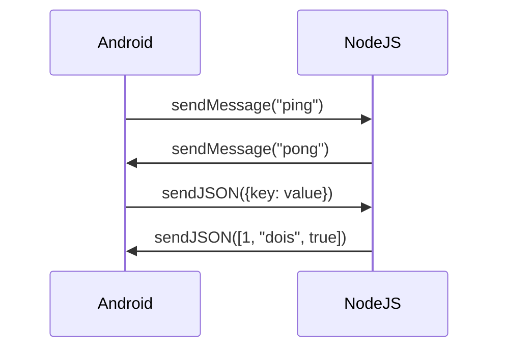

# NodeJS Mobile: Bridge entre Java (Android) e Node.js

[](https://jitpack.io/#devicewhite/NodeJS_Mobile)

Biblioteca para comunicação em tempo real entre aplicativos Android (Java) e Node.js, suportando troca de mensagens de texto e JSON com detecção automática de tipos.

## Pré-requisitos
- Android Studio ou AIDE+ (versão mais recente)
- Node.js instalado
- Conhecimento básico de Java e JavaScript

## Instalação

### No projeto Android (Java)
1. Adicione o repositório JitPack ao `build.gradle` do projeto:
```gradle
allprojects {
    repositories {
        maven { url 'https://jitpack.io' }
    }
}
```

2. Adicione a dependência no `build.gradle` do módulo:
```gradle
dependencies {
    implementation 'com.github.devicewhite:NodeJS_Mobile:1.0.0'
}
```

### No projeto Node.js
Execute no terminal do seu projeto:
```bash
npm install nodejs-mobile
```

## Configuração Básica

### Lado Android (Java)
```java
// MainActivity.java
import org.mobile.NodeJS;
import org.json.JSONArray;
import org.json.JSONObject;

public class MainActivity extends AppCompatActivity {
    private NodeJS node;

    @Override
    protected void onCreate(Bundle savedInstanceState) {
        super.onCreate(savedInstanceState);
        setContentView(R.layout.activity_main);

        node = new NodeJS(() -> {
            // Métodos customizados
            private void sendToast(final String message) {
                runOnUiThread(() -> 
                    Toast.makeText(MainActivity.this, message, Toast.LENGTH_SHORT).show()
                );
            }
            
            @Override
            public void onOutput(String message) {
                Log.d("NodeJS Log", message);
            }
            
            @Override
            public void onError(String message) {
                Log.e("NodeJS Error", message);
            }
            
            @Override
            public void onMessage(int type, String rawText, JSONArray array, JSONObject object) {
                Log.d("NodeJS Message", "Tipo: " + type + ", Texto: " + rawText);
                
                switch (type) {
                    case NodeJS.OnNodeListener.MESSAGE_TYPE_RAW_TEXT:
                        if ("ping".equals(rawText)) {
                            node.sendMessage("pong");
                        }
                        break;
                    case NodeJS.OnNodeListener.MESSAGE_TYPE_JSON_ARRAY:
                        for (int i = 0; i < array.length(); i++) {
                            sendToast("Item " + i + ": " + array.opt(i));
                        }
                        break;
                    case NodeJS.OnNodeListener.MESSAGE_TYPE_JSON_OBJECT:
                        if (object.has("key")) {
                            sendToast("Valor recebido: " + object.optString("key"));
                        }
                        break;
                }
            }
        });

        // Iniciar Node.js em thread separada
        new Thread(() -> {
            node.runCode("console.log('Node.js inicializado!');");
            // node.runFile(new File("caminho/para/seu/script.js"));
        }).start();
    }
}
```

### Lado Node.js
```javascript
// index.js
const bridge = require('nodejs-mobile');

// Ouvir mensagens do Android
bridge.onMessage((msg) => {
  console.log('Recebido do Android:', msg);
  
  if (typeof msg === 'string') {
    console.log('Mensagem de texto:', msg);
  } 
  else if (typeof msg === 'object') {
    if (Array.isArray(msg)) {
      console.log('Array JSON:', msg);
    } else {
      console.log('Objeto JSON:', msg);
    }
  }
});

// Enviar mensagens para Android
setInterval(() => {
  // Enviar texto simples
  bridge.sendMessage('Hello from Node.js!');
  
  // Enviar objeto JSON
  bridge.sendJSON({ 
    timestamp: Date.now(),
    message: "Conexão ativa" 
  });
  
  // Enviar array JSON
  bridge.sendJSON([1, "dois", true]);
}, 3000);
```

## Tipos de Mensagens Suportados

| Tipo         | Java (Android)                     | Node.js                     |
|--------------|-------------------------------------|-----------------------------|
| Texto Simples| `MESSAGE_TYPE_RAW_TEXT`             | `typeof msg === 'string'`   |
| JSON Object  | `MESSAGE_TYPE_JSON_OBJECT`          | `typeof msg === 'object'`   |
| JSON Array   | `MESSAGE_TYPE_JSON_ARRAY`           | `Array.isArray(msg)`        |

## Métodos Principais

### No lado Java:
- `sendMessage(String text)`: Envia texto simples
- `sendJSON(JSONObject obj)`: Envia objeto JSON
- `sendJSON(JSONArray array)`: Envia array JSON
- `runCode(String code)`: Executa código JavaScript
- `runFile(File file)`: Executa arquivo JavaScript

### No lado Node.js:
- `sendMessage(String text)`: Envia texto simples
- `sendJSON(Object obj)`: Envia objeto/array JSON
- `onMessage(callback)`: Recebe mensagens do Android

## Fluxo de Comunicação


## Dicas para Iniciantes

1. **Ambiente de Desenvolvimento**:
   - Use Android Studio ou AIDE+ para Java
   - Use VS Code ou Spck Editor para Node.js

2. **Primeiros Passos**:
   - Comece com mensagens de texto simples
   - Teste com `console.log`/`Log.d` para depuração
   - Use o exemplo básico fornecido como ponto de partida

3. **Problemas Comuns**:
   - Verifique se as dependências estão corretamente instaladas
   - Certifique-se que o Node.js está sendo iniciado em uma thread separada
   - Use `runOnUiThread` para atualizar a interface do Android
